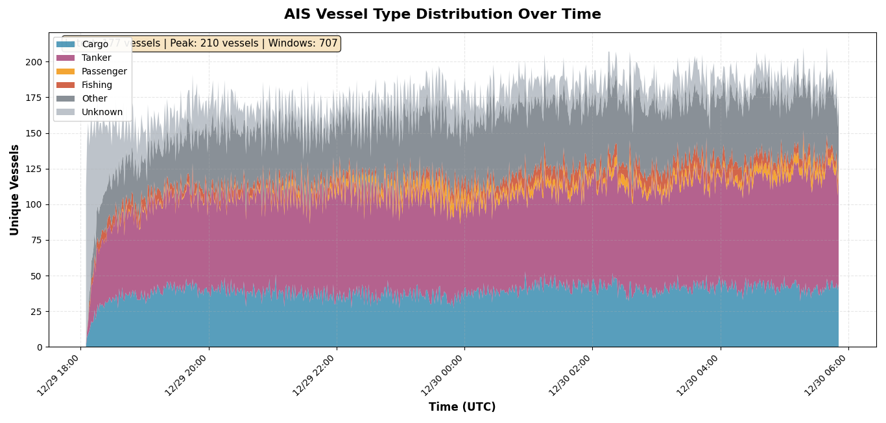

# AIS Vessel Traffic Stream Analytics

A real-time maritime traffic monitoring system that streams live AIS (Automatic Identification System) data, performs windowed aggregation, and visualizes vessel patterns over time.


> **Note:** This project was created with assistance from Claude (Anthropic) as a learning exercise in streaming data processing and real-time analytics.

## Overview

This project demonstrates real-time streaming data processing by:
- **Ingesting** live vessel data via WebSocket from [AISStream.io](https://aisstream.io)
- **Aggregating** vessel counts by type using sliding 1-minute windows
- **Storing** aggregated data efficiently in SQLite (~1MB/day vs 1.5GB for raw data)
- **Visualizing** traffic patterns with a live-updating dashboard

## Example Output


*Real-time vessel traffic visualization - Singapore Strait region over 11 hours*

The dashboard displays vessel traffic composition over time:

- **Cargo** (blue) - Container ships, bulk carriers
- **Tanker** (purple) - Oil tankers, chemical tankers
- **Passenger** (orange) - Cruise ships, ferries
- **Fishing** (red) - Fishing vessels
- **Other** (gray) - Tugs, pilot boats, military
- **Unknown** (light gray) - Vessels awaiting metadata

This example shows overnight traffic patterns in the Singapore Strait, one of the world's busiest shipping lanes. Traffic varies by time of day, with cargo and tanker vessels dominating the commercial traffic.

**Typical metrics:**
- Singapore Strait: 300-500 unique vessels per minute
- US East Coast: 200-300 unique vessels per minute
- Mediterranean: 150-250 unique vessels per minute

## Quick Start

### Prerequisites

- Python 3.11+
- Free API key from [aisstream.io](https://aisstream.io). Just log in with github credentials, get the API key and paste it into file config.py. All under one minute

### Installation

```bash
# Clone the repository
git clone https://github.com/DonSchott/ais-vessel-stream.git
cd ais-vessel-stream

# Create virtual environment
uv venv --python python3.11 .venv
source .venv/bin/activate  # On Windows: .venv\Scripts\activate

# Install dependencies
uv pip install -r requirements.txt
```

### Configuration

Edit `config.py` and add your API key:

```python
AISSTREAM_API_KEY = "your_api_key_here"
```

### Run

```bash
# Terminal 1 - Start data collection
python3 main.py

# Terminal 2 - Start visualization (after 1-2 minutes)
python3 visualize.py
```

## Project Structure

```
ais-vessel-stream/
├── main.py              # Pipeline coordinator
├── config.py            # Configuration (API key, region, settings)
├── ais_client.py        # WebSocket client
├── aggregator.py        # Streaming aggregation engine
├── database.py          # SQLite operations
├── visualize.py         # Real-time dashboard
├── requirements.txt     # Dependencies
├── check_status.py      # Database diagnostics
└── README.md           # This file
```

## How It Works

### Architecture

```
AISStream.io → WebSocket → Aggregator → SQLite → Visualization
    (API)        Client     (Windows)   (Storage)   (Dashboard)
```

### Data Flow

1. **WebSocket Client** connects to AISStream API and receives messages
2. **Aggregator** maintains sliding time windows and tracks unique vessels
3. **Database** persists only aggregated counts (not raw messages)
4. **Visualization** queries database every 5 seconds and updates chart

### Key Design Decisions

- **True streaming**: Event-driven window closing, not batch processing
- **Memory efficient**: Only current window in RAM (~20MB)
- **Disk efficient**: Stores aggregates only (3000x smaller than raw)
- **Scalable**: Handles 100+ messages/second on a laptop

## Configuration Options

### Change Geographic Region

Edit `config.py`:

```python
BOUNDING_BOX = [
    [lat_sw, lon_sw],  # Southwest corner
    [lat_ne, lon_ne]   # Northeast corner
]
```

**Example regions:**
- Mediterranean: `[[30, -6], [46, 37]]`
- English Channel: `[[49, -6], [52, 3]]`
- Singapore Strait: `[[1, 103], [2, 105]]`

### Change Aggregation Window

```python
AGGREGATION_WINDOW_SECONDS = 300  # 5 minutes instead of 1
```

## Utilities

### Check Pipeline Status

```bash
python3 check_status.py
```

Shows database statistics, time range, and vessel counts.

### Export Data

```python
import pandas as pd
import sqlite3

conn = sqlite3.connect('ais_vessel_data.db')
df = pd.read_sql_query('SELECT * FROM vessel_counts', conn)
df.to_csv('export.csv', index=False)
```

## Performance

| Metric | Typical Value |
|--------|---------------|
| Message rate | 50-100 msg/sec |
| Processing time | <1ms per message |
| Database growth | ~1MB/day |
| Memory usage | ~65MB total |
| CPU usage | <5% |

Tested on Ubuntu 24.04 with Python 3.11, 8GB RAM, 2 CPU cores.

## Troubleshooting

| Issue | Solution |
|-------|----------|
| No data appearing | Wait 60+ seconds for first window to close |
| Empty visualization | Ensure both scripts run from same directory |
| High "Unknown" category | Normal at startup; decreases after 10-15 min |
| API connection fails | Check API key in `config.py` |

## What You'll Learn

This project demonstrates:
- WebSocket communication for real-time data
- Event-driven architecture and streaming windows
- Set-based aggregation for deduplication
- Async Python programming patterns
- Time-series database design
- Real-time data visualization with Matplotlib

## Resources

- [AISStream API Documentation](https://aisstream.io/documentation)
- [AIS Message Types](https://www.imo.org/)


## Acknowledgments

- AIS data provided by [AISStream.io](https://aisstream.io)
- Built with Python, websockets, pandas, matplotlib, SQLite

